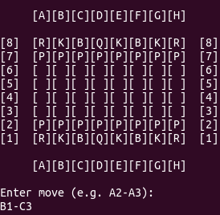
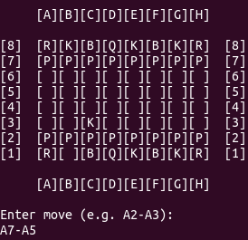
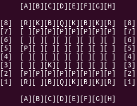

# Console-based Chess game
>Benzon Carlitos Salazar

This is a console based chess game written in Java

Move 1 for Player 1: B1-C3

Move 1 for Player 2: A7-A5

Current Game state for both players:
